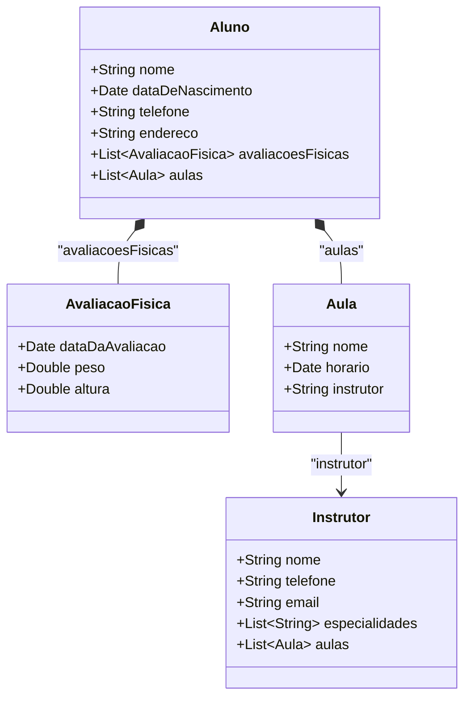
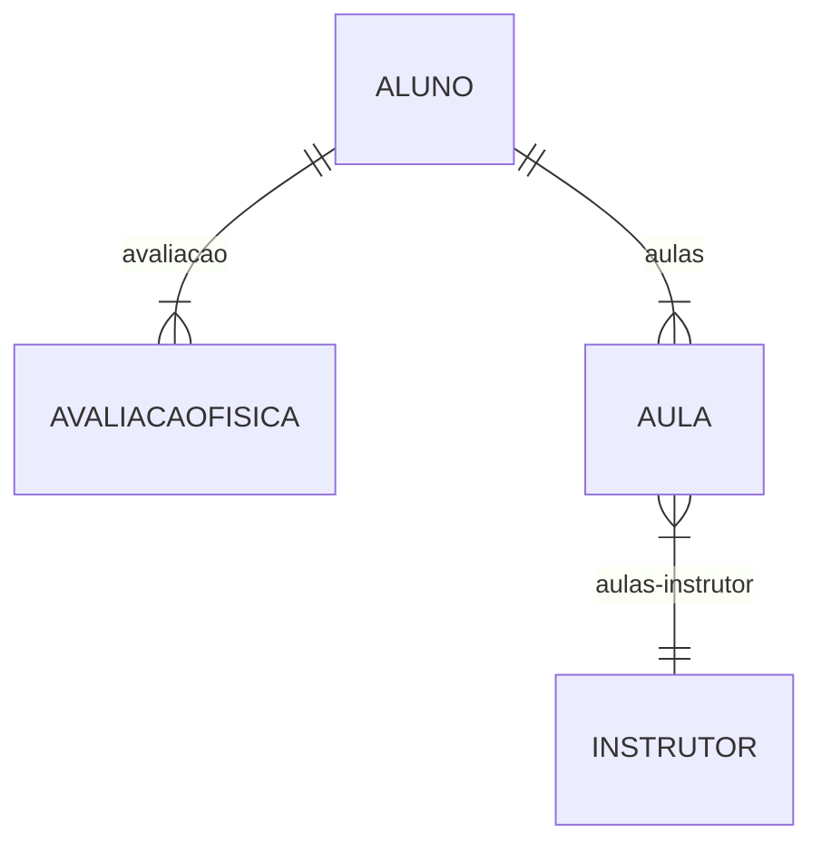

# Academia-Digital 💪

Este é um projeto fullstack desenvolvido utilizando **Spring Boot**  no [backend]() e **ReactJS** no [frontend](). O objetivo do projeto é fornecer uma aplicação completa com uma **API RESTful** e uma interface de usuário moderna e responsiva, para o sistema de cadastro de uma academia.

## Design ✨

|  |  |
| --- | --- |

## Tecnologias Utilizadas 🛠️

| **Backend** | **Frontend** |
| --- | --- |
| Spring Boot | ReactJs |
| Spring Data JPA | React Router |
| H2 Data Base | Gerenciamento de estado. |
| Gradle | TailwindCss |
| Java 17 | Java Script |

## Funcionalidades Principais ⚙️

O sistema disponibiliza ao usuário as funções de um sistema CRUD, com as devidas regras de negócio, para as seguintes entidades relacionadas: `Aluno`, `Aula`, `Instrutor` e `AvaliacaoFisica`, veja nos diagramas a seguir:

## Diagrama de Classes

## Diagrama ORM

## Contatos 📞

Caso tenha alguma sugestão sinta-se à vontade para contribuir com este projeto ou me contatar.
 - **email:** msilvachaves02@gmail.com
 - **celular:** (98) 98248-8698
